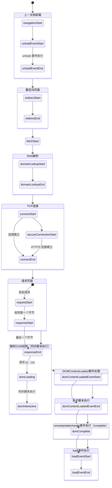

## 概述

`PerformanceTiming` 为 `window.performance.timing` 对象。记录 html 文档加载过程的时间线。了解 `PerformanceTiming` API 的具体含义，可以记录页面路径渲染的阻塞。以此来达到优化渲染速度的目的。

## 关键节点备注

仅记录一些关键节点，具体信息可参考 [API](https://developer.mozilla.org/zh-CN/docs/Web/API/PerformanceTiming) 及下方时间线

| PerformanceTiming | 注 |
| -- | -- |
| redirectStart-redirectEnd | 重定向时间，可减少重定向来优化 |
| fetchStart | 正儿八经开始请求本文档，不考虑上一文档及重定向时间 |
| responseEnd | html 文档接收完毕，来源可能是服务器或缓存 |
| domLoading | 开始解析文档，JS\CSS 已发出请求 |
| domInteractive | 同步脚本执行完毕，页面可交互。开始加载图片等子资源 |
| domComplete | 异步脚本执行完毕 |
| loadEventEnd | load 事件执行完毕，除异步加载 JS 外，页面加载完毕 |

## 相关名词对应

| 名词 | PerformanceTiming | 注 |
| -- | -- | -- |
| TTFB | responseStart | 第一个字节到达的时间。体现了服务端响应页面的速度 |
| 白屏时间 | domLoading | 能看到当前文档大概布局的时间。体现了 TTFB 之后的渲染路径顺序 |
| 可交互时间 | domInteractive | 文档主要结构可交互时间。体现了同步脚本执行时间 |

## 时间线


## 关联事件

### document.readyState

文档加载过程，会触发 `readystatechange` 事件，改变 `readyState` 状态。`PerformanceTiming` 会记录对应状态的时间。

#### 对应字段

| PerformanceTiming | readyState | 注 |
| -- | -- | -- |
| domLoading | loading | 文档加载中 |
| domInteractive | interactive | DOM元素加载完成，会执行需要立即执行的脚本 |
| domComplete | complete | 文档加载完成 |

#### 监听事件
```JavaScript
document.onreadystatechange = () => {
  if (document.readyState === "complete") {
    // do something...
  }
}
```

#### 备注
- 如 `readyState` 多次更改为相同状态，则 `PerformanceTiming` 返回更改首次出现的时间;
- 先返回 `PerformanceTiming` 对应字段的时间，再修改 `readyState` 状态


### DOMContentLoaded

#### 对应关系
1. `domContentLoadedEventStart` 返回时间
2. 触发 `DOMContentLoaded` 事件
3. `DOMContentLoaded` 事件执行完成
4. 返回 `domContentLoadedEventEnd` 时间

#### 监听事件
```JavaScript
document.addEventListener('DOMContentLoaded', () => {
  // do something...
})
```

### load

#### 对应关系
1. `unloadEventStart` 返回时间
2. 触发 `load` 事件
3. `load` 事件执行完成
4. 返回 `loadEventEnd` 时间

#### 监听事件
```JavaScript
// 可以挂载多个监听
window.addEventListener('load', () => {
  // do something...
})

// 重复赋值会被覆盖
window.onload = () => {
  // do something...
}
```

### unload

> 当文档或一个子资源正在被卸载时, 触发 unload事件

关联事件： `beforeunload`, `pagehide`

#### 对应关系
1. `loadEventStart` 返回时间
2. 触发 `unload` 事件
3. `unload` 事件执行完成
4. 返回 `unloadEventEnd` 时间

#### 监听事件
```JavaScript
window.addEventListener('unload', () => {
  // do something...
})
```

## 阻塞测试

#### head 部分 js 或 css 请求时间长

结果：
- readyState === 'loading'
- 不阻塞html 子资源请求（包括js\css\图片等）
- 阻塞样式解析、样式内部字体文件下载
- 阻塞DOM、CSSOM 解析

结论：
- 尽量不放同步 js 在 head
- 可以放一些 js 在 head 预下载
- 不放太大，且和首批无关的文件在 head

#### body 结尾部分 js 或 css 请求时间长

结果：
- readyState === 'loading'
- 不阻塞页面渲染


## 参考文档
[performance](https://varvy.com/performance/)

[PerformanceTiming 对象 API](https://developer.mozilla.org/zh-CN/docs/Web/API/PerformanceTiming)

[w3c-dom-performancetiming](https://www.w3.org/TR/2012/REC-navigation-timing-20121217/#dom-performancetiming-domcontenteventstart)

[一文读懂一个URL请求的过程是怎样的](https://juejin.im/post/5b83b0bfe51d4538c63131a8)