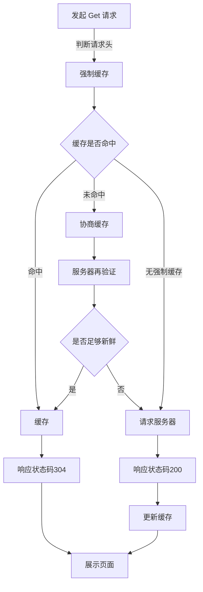

## 概述
浏览器缓存分为本地缓存和代理缓存（CDN），本地缓存为私有缓存，只针对当前环境。代理缓存，指当前地域附件客户端的缓存。

缓存策略分为强制缓存及协商缓存。浏览器会先判断是否满足强制缓存策略。如缓存命中，则直接读取缓存。
否则，向服务器请求判断缓存是否可用，根据协商缓存判断。如符合，则返回 304，读取缓存。否则返回 200，及请求资源，并重新写入缓存。

仅以 `get` 请求举例

## 强制缓存
***优先级***：Pragma > Cache-Control > expires

缓存设置主要由请求头中的 `Expires`、`Pragma` 和 `Cache-Control` 来设置。
- `Pragma` 是 HTTP1.0 的字段，值为 `no-cache` 时，禁用缓存。
- `Expires` 是 HTTP1.0 的字段，值为一个绝对的时间值。超过这个日期，则向服务器请求新鲜度
- `Cache-Control` 是 HTTP1.1 的字段，优先级更高。其中有以下属性
    - `max-age=xxx` 值为相对时间值，单位为秒。超过这个日期，则向服务器请求新鲜度。为0，则先向服务器请求新鲜度
    - `public`：所有内容都被缓存 (客户端和代理服务器都可缓存)
    - `private`：所有内容只有客户端可以缓存，代理服务器不能缓存。Cache-Control的默认取值
    - `no-cache`：客户端缓存内容，但是是否使用缓存则需要经过协商缓存来验证决定
    - `no-store`：所有内容都不会被缓存，即不使用强制缓存，也不使用协商缓存
   
## 协商缓存

附带条件包括If-Modified-Since,If-Unmodified-Since,If-Match,If-None-Match字段

***优先级***：If-None-Match > If-Modified-Since
***`Last-Modified`标识***：上次文件修改的时间
***`ETag`标识***：生成一串标识符，用来对比文件是否有被修改

- `If-Modified-Since`，默认带上上次响应头的 `Last-Modified` 时间。如果服务器在给定的时间之后对内容进行过修改，则状态码为 `200`，并将资源返回。否则，返回不带消息主体的 `304` 相应
- `If-None-Match`，默认带上上次响应头的 `ETag` 标识。如果服务器的`ETag` 不一致，则状态码为 `200`，并将资源返回。否则，返回不带消息主体的 `304` 相应

***注***:当使用能够引发服务器状态改变的方法（post、put），且未满足条件时。`If-Unmodified-Since` 和 `If-None-Match` 会返回 `412` 状态码拒绝请求。

## 参考文档
[彻底理解浏览器的缓存机制](https://heyingye.github.io/2018/04/16/%E5%BD%BB%E5%BA%95%E7%90%86%E8%A7%A3%E6%B5%8F%E8%A7%88%E5%99%A8%E7%9A%84%E7%BC%93%E5%AD%98%E6%9C%BA%E5%88%B6/)

[浏览器缓存和Service Worker](https://www.cnblogs.com/bill-shooting/p/9347441.html)

[HTTP缓存控制小结](https://imweb.io/topic/5795dcb6fb312541492eda8c)