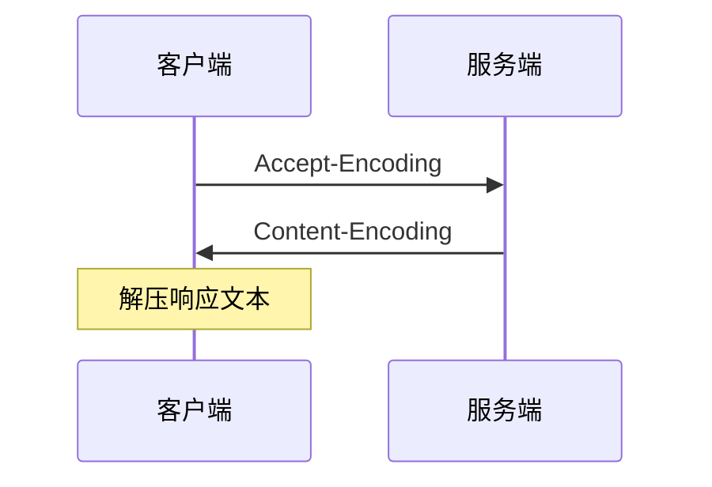

## 概述

常用的压缩模式有：`gzip`, `deflate`, `br`。压缩模式之间差异体现在压缩比、压缩速度、服务器资源占用。

- `Accept-Encoding`: 请求首部，说明支持的压缩模式；
- `Content-Encoding`: 响应首部，说明实际采用压缩模式；

**_请求路径：_**



## nginx 开启 gzip 压缩

一般 nginx 默认开启 gzip 压缩，但是只针对 html 文件。不会压缩非常小的文件。
[nginx-gzip 官网](http://nginx.org/en/docs/http/ngx_http_gzip_module.html)

```Nginx
http {
  gzip on;
  gzip_static on;
  gzip_min_length 256;
  gzip_types text/plain text/css application/json application/x-javascript text/xml application/xml application/xml+rss text/javascript application/javascript image/svg+xml;
}
```

## nginx 开启 Brotli(br) 压缩

**_这里列举的是 centos 在已安装 nginx 下的情况下的配置方式_**

### 下载 Brotli

`google/ngx_brotli` 从 16 年 12 月的版本起，开始内置 `google/brotli`，所以不需要额外编译 `bagder/libbrotli` 库。

```Bash
cd /usr/local/src
git clone https://github.com/google/ngx_brotli.git
```

替换 `brotli`

```Bash
cd ngx_brotli/deps && rm-rf brotli
git clone git@github.com:google/brotli.git
cd ../ && git submodule update --init
```

### 编译 Brotli 模块

因为 nginx 已安装，但是需要生成动态模块。所以这里重新下载一个相同版本来生成。生成后，将生成的模块复制到原 nginx 对应文件（仅支持 `^nginx1.9.11`）。

输入 `nginx -V` ，查看当前 nginx 信息

1. nginx version: 版本信息，下载对应版本（举例用 `1.17.9`）
2. --modules-path: 模块目录（举例用 `/usr/lib64/nginx/modules`）

下载并解压

```Bash
wget http://nginx.org/download/nginx-1.17.9.tar.gz
tar -xvf nginx-1.17.9.tar.gz
```

编译动态模块，`--add-dynamic-module` 后为上面下载 `ngx_brotli` 的绝对路径

```Bash
cd nginx-1.17.9
./configure --with-compat --add-dynamic-module=/usr/local/src/ngx_brotli
make modules
```

配置后，会在 `nginx-1.17.9/objs` 下生成需要的 `brotli` 模块。现在复制到原 `nginx` 模块目录下。

```Bash
cp objs/{ngx_http_brotli_filter_module.so,ngx_http_brotli_static_module.so} /usr/lib64/nginx/modules
```

### 注册 Brotli 模块

因为 nginx-1.17.9 默认引入模块的配置文件在 `/usr/share/nginx/modules/*.conf` 下。所以这里也在对应目录创建配置文件

```Bash
cd /usr/share/nginx/modules/*.conf
touch mod-brotli.conf
```

在配置文件中指向 `brotli` 的模块目录

```Bash
load_module "/usr/lib64/nginx/modules/ngx_http_brotli_filter_module.so";
load_module "/usr/lib64/nginx/modules/ngx_http_brotli_static_module.so";
```

如使用不同版本，可能需要在 `nginx.conf` 中 引入配置文件

```Bash
include /usr/share/nginx/mod-brotli.conf
# 或者和 nginx-1.17.9 一样模糊匹配
include /usr/share/nginx/modules/*.conf
```

### 启用 Brotli 模块

Brotli 和 gzip 是可以并存的，无需关闭 gzip.

配置 `nginx.conf` 文件

```Nginx
http {
  # brotli
  brotli on;
  brotli_static on;
  brotli_comp_level 6;
  brotli_buffers 16 8k;
  brotli_min_length 20;
  brotli_types text/plain text/css application/json application/x-javascript text/xml application/xml application/xml+rss text/javascript application/javascript image/svg+xml;
}
```

反向代理不需要压缩，设置响应头

```Nginx
server {
    ...
    location / {
        ...
        proxy_set_header Accept-Encoding "";
        ...
    }
    ...
}
```

## 压缩测试

可以同时开启 gzip 和 br

[压缩测试](https://tools.paulcalvano.com/compression.php)

## 备注

- 图片、视频之类的二进制文件，本身已经经过压缩。如再采用上述压缩模式，生成的文件实际上将比原始文件大

## 拓展

配置压缩之后，每次请求都会消耗服务器资源压缩文件。建议使用预压缩。Nginx 有响应的预压缩模块，也可以在用 webpack 打包时预压缩。（预压缩一定要开启 gzip_static 或 brotli_static）
推荐阅读: [Webpack 生成预压缩 gzip、brotli 文件](/article/Webpack%20生成预压缩%20gzip、brotli%20文件)

## 参考文档

[MDN](https://developer.mozilla.org/zh-CN/docs/Web/HTTP/Headers/Content-Encoding)
['You can't use Brotli for dynamic content'](https://expeditedsecurity.com/blog/nginx-brotli/)
[ngx_brotli](https://github.com/google/ngx_brotli)
